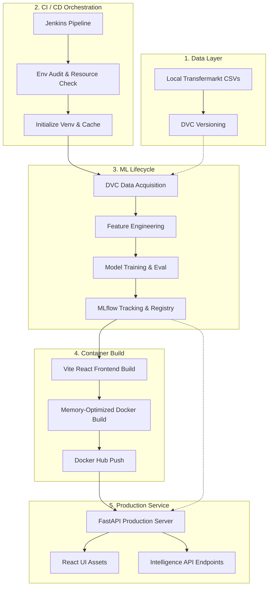

# Football Market Value Intelligence Platform

An end-to-end MLOps platform for analyzing and predicting football player market values using an embedded, offline Transfermarkt dataset.

## Features

*   **Scenario Simulator:** Search any player from our local dataset to auto-populate their actual stats, iteratively overriding individual attributes (such as age or club tenure) to run real-time counterfactual market value predictions.
*   **Market Value Prediction:** Ensemble regression models (LightGBM, XGBoost, Random Forest) predict a player's absolute value based on age, position, career span, and performance multipliers.
*   **Trajectory Classification:** Classifies a player's career phase (rising star, growing, stable, declining) using feature-engineered historical data and volatility index.
*   **Time Series Forecasting:** Autoregressive prediction of future market values based on lagged historical valuation using a dedicated forecasting model.
*   **Live Metrics Dashboard:** Exposes interactive model evaluation metrics generated directly via MLflow tracking logs.
*   **React + Tailwind UI:** Modern glassmorphism aesthetics constructed with Vite, React, vanilla Tailwind, and Recharts.
*   **Docker Ready:** Configured to instantly spin up via `docker-compose`.

## Architecture

### System Flowchart



*   **Backend:** FastAPI, Pandas, scikit-learn, XGBoost, LightGBM
*   **Frontend:** Vite, React, Tailwind CSS, Recharts, Lucide-React
*   **MLOps:** MLflow (experiment tracking), DVC (data versioning)
*   **Deployment:** Jenkins CI/CD, Dockerfiles, Multi-stage Builds
*   **Offline Mode:** 100% decoupled from 3rd-party live APIs; relies solely on cached, sanitized local knowledge bases for lightning-fast querying.

## Running Locally

### Option 1: Docker (Recommended)
You can build and run both the FastAPI backend and React frontend concurrently via Docker Compose:
```bash
docker-compose up --build
```
- Core App & Dashboard: `http://localhost:8000`
- MLflow Tracking Server: `http://localhost:5050`
- Interactive API Docs (Swagger): `http://localhost:8000/docs`
- Alternative API Docs (ReDoc): `http://localhost:8000/redoc`
- Jenkins CI/CD Orchestrator: `http://localhost:8080/job/EliteScout/`

### Option 2: Manual Installation

1. **Install Python Backend Requirements:**
   ```bash
   pip install -r backend/requirements.txt
   ```

2. **Train Models (Optional):**
   Models are pre-trained inside `/models/`, but you can re-generate them via:
   ```bash
   python -m backend.app.ml.train_regression
   python -m backend.app.ml.train_classifier
   python -m backend.app.ml.train_timeseries
   ```

3. **Run Backend & Serve Frontend:**
   First, compile the frontend assets:
   ```bash
   cd frontend
   npm install
   npm run build
   cd ..
   ```
   Launch Uvicorn to serve the API + static UI assets:
   ```bash
   python -m uvicorn backend.app.main:app --host 0.0.0.0 --port 8000
   ```
   Open `http://localhost:8000` in your browser.
